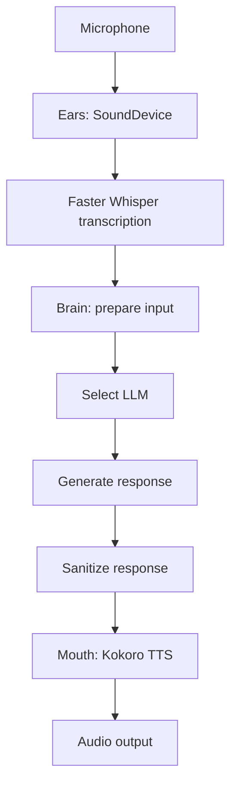
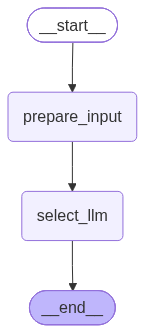
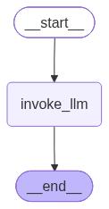
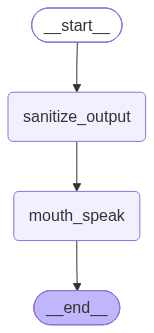
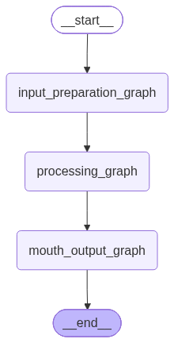

# ATLAS Voice Assistant

ATLAS is a Python voice assistant built around a simple biological metaphor:

- **Ears** capture microphone audio and transcribe speech - STT.
- **Brain** prepares the request, selects an available language model, and processes the response through LangGraph.
- **Mouth** converts the response to speech with Kokoro TTS.

The project is designed for a Windows machine with an NVIDIA GPU, but the language-model layer can fall back to a local Ollama model when cloud connectivity is unavailable.

## Architecture



### Brain graphs

The brain is composed of three subgraphs:
1. **Input preparation graph**: builds the persona system prompt and the user message, then selects the active LLM.
2. **Processing graph**: invokes the selected LLM and extracts its text response.
3. **Speech graph**: sanitizes the response for speech and passes it to the mouth organ.
  
The **Master graph** executes those three subgraphs sequentially.

## Project structure

```text
ATLAS-Voice_Assistant/
├── atlas.py                   # Application supervisor and main entry point
├── llm.py                     # Online/offline LLM selection and fallback chain
├── pyproject.toml             # Project metadata and dependencies
├── workflow.ipynb             # Notebook that renders graph diagrams as PNGs
├── Behaviour/
│   └── persona.py             # Persona prompt and system-state responses
├── Organs/
│   ├── ears.py                # Microphone capture and speech-to-text
│   ├── brain.py               # LangGraph reasoning pipeline
│   └── mouth.py               # Text-to-speech output
├── Info-organs/               # Explanations of the three organ modules
└── Organs_Showcase/           # Supporting showcase and PDF generation tools
```

## Requirements

- Windows with Python **3.13 or newer**
- A working microphone and audio output device
- NVIDIA GPU and compatible CUDA runtime for the configured Whisper, Kokoro, and PyTorch setup
- `uv` for environment and dependency management
- An Ollama installation if the local fallback model is used
- The `qwen2.5:3b` Ollama model for the offline fallback:

```powershell
ollama pull qwen2.5:3b
```

The configured PyTorch dependency is `torch==2.11.0+cu128`, installed from the CUDA 12.8 PyTorch index declared in `pyproject.toml`.

## Installation

From the project directory, create or synchronize the virtual environment:

```powershell
uv sync
```

Activate it in PowerShell:

```powershell
.\.venv\Scripts\Activate.ps1
```

If PowerShell blocks script execution for the current terminal, use:

```powershell
Set-ExecutionPolicy -Scope Process -ExecutionPolicy RemoteSigned
```

## Configuration

Create a `.env` file in the project root. Cloud keys are optional if Ollama is configured locally.

```dotenv
GEMINI_API_KEY=your_gemini_api_key
GROQ_API_KEY=your_groq_api_key
```

The LLM waterfall is configured in `llm.py`:

1. Gemini 3.7 Flash
2. Gemini 2.0 Flash
3. Groq Llama 3.3 70B
4. Groq Llama 3.1 8B
5. Local Ollama `qwen2.5:3b`

When the connectivity probe reports that the machine is offline, the local Ollama model is selected directly. When online, the cloud models are tried in order and the configured fallbacks handle provider failures.

## Running ATLAS

Start the application with:

```powershell
uv run python atlas.py
```

The application initializes the audio and model components, starts microphone listening, transcribes a spoken prompt, sends the completed prompt to the brain, and speaks the response.

Press `Ctrl+C` to request shutdown.

### Current listening behavior

The current `ears.py` implementation records and transcribes one prompt cycle. It treats a five-second audio chunk with no recognized speech as the end of the prompt, sends the collected text to the brain, and exits that transcription cycle. Continuous multi-prompt listening will require calling the listening entry point again or extending the recorder/transcriber loop.

## Viewing the graph flowcharts

Open `workflow.ipynb` in VS Code with the Jupyter extension and run its Python cell. It renders four embedded PNG diagrams:

1. Input preparation and LLM selection  
  
2. LLM processing  
  
3. Sanitization and mouth output  
  
4. Complete master graph  
  

The notebook uses LangGraph's PNG renderer directly. Run the cell in VS Code's notebook editor or Interactive Window to see the rendered diagrams.

## Organ documentation

The `Info-organs` directory contains plain-text explanations of the current organ implementations:

- `Info-organs/ears.txt`
- `Info-organs/brain.txt`
- `Info-organs/mouth.txt`

## Troubleshooting

### Microphone or playback errors

Check that Windows has granted microphone access to Python or VS Code, and confirm that the default input and output devices work with SoundDevice.

### CUDA or model-loading errors

Confirm that the NVIDIA driver, CUDA-compatible PyTorch build, and GPU memory are available. Whisper and Kokoro are configured to use `device="cuda"`.

### Cloud model errors

Verify the relevant API key in `.env`. If the machine is offline, make sure Ollama is running and that `qwen2.5:3b` is installed.

### Kokoro errors

The mouth organ always prints the generated response before attempting speech synthesis. If Kokoro fails, inspect the exception for missing model, audio-device, or CUDA configuration issues.

## Development notes

- The project uses LangGraph `StateGraph` to make the brain pipeline explicit and visualizable.
- The persona is generated dynamically, including a title and demeanor selected for each request.
- Brain responses are sanitized before text-to-speech so Markdown formatting is not spoken aloud.
- Do not commit `.env` or API keys to source control.

## Future imporvements

- Add a GUI for configuration and status display
- Further tools for the second graph for LLM processing or thinking
- Implementation of RAG (retrieval-augmented generation) for knowledge retrieval and context-aware responses
- Further Behavioural files will be added to update the tonality and the respose format of the assistant
- Continuous listening and multi-prompt handling
- Add a local knowledge base for offline operation
